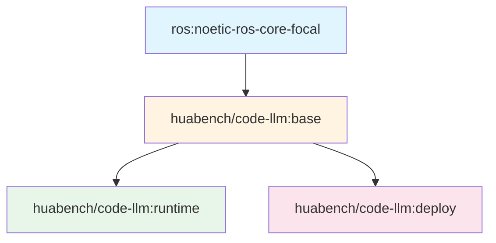

# Docker构建与运行完全指南

## 概述

本文档详细介绍GenSwarm项目的Docker镜像构建流程，从零开始讲解如何构建多阶段镜像、配置环境，以及如何运行容器完成代码生成和测试任务。

## 目录

1. [镜像架构](#镜像架构)
2. [前置准备](#前置准备)
3. [构建流程](#构建流程)
4. [运行容器](#运行容器)
5. [常用命令](#常用命令)
6. [故障排查](#故障排查)

---

## 镜像架构

GenSwarm采用**多阶段Docker镜像构建策略**，分为三个层次：



### 镜像层次说明

| 镜像 | 用途 | 基础镜像 | 关键组件 |
|------|------|---------|---------|
| **base** | 基础环境 | ros:noetic-ros-core-focal | ROS Noetic + Miniconda + Python |
| **runtime** | 代码生成运行环境 | huabench/code-llm:base | 完整依赖 + GenSwarm代码 |
| **deploy** | 真实硬件部署 | huabench/code-llm:base | Ansible + SSH工具 |

---

## 前置准备

### 1. 系统要求

- **操作系统**: Linux (x86_64 或 aarch64) / macOS / Windows with WSL2
- **Docker版本**: Docker Engine 20.10+ 或 Docker Desktop 4.0+
- **Docker Compose**: 2.0+
- **磁盘空间**: 至少 10GB 可用空间
- **内存**: 建议 8GB+

### 2. 安装Docker

#### Linux (Ubuntu，推荐)
```bash
# 安装Docker
curl -fsSL https://get.docker.com -o get-docker.sh
sudo sh get-docker.sh

# 将当前用户添加到docker组（避免每次使用sudo）
sudo usermod -aG docker $USER
newgrp docker

# 安装Docker Compose
sudo curl -L "https://github.com/docker/compose/releases/latest/download/docker-compose-$(uname -s)-$(uname -m)" -o /usr/local/bin/docker-compose
sudo chmod +x /usr/local/bin/docker-compose
```

#### macOS
```bash
# 使用Homebrew安装
brew install --cask docker

# 或下载Docker Desktop
# https://www.docker.com/products/docker-desktop
```

#### Windows (WSL2)
```bash
# 1. 安装WSL2: https://learn.microsoft.com/zh-cn/windows/wsl/install
# 2. 下载安装Docker Desktop: https://www.docker.com/products/docker-desktop
# 3. 在Docker Desktop设置中启用WSL2集成
```

### 3. 验证安装

```bash
# 检查Docker版本
docker --version
# 输出示例: Docker version 24.0.7, build afdd53b

# 检查Docker Compose版本
docker compose version
# 输出示例: Docker Compose version v2.23.0

# 测试Docker运行
docker run hello-world
```

### 4. 项目结构检查

确保你在GenSwarm项目根目录，并且有以下文件结构：

```
GenSwarm/
├── docker/
│   ├── base.Dockerfile          # 基础镜像定义
│   ├── runtime.Dockerfile       # 运行时镜像定义
│   ├── deploy.Dockerfile        # 部署镜像定义
│   ├── docker-compose.yml       # Docker Compose配置
│   └── ansible/                 # Ansible部署脚本
├── requirements.txt             # Python依赖列表
├── modules/                     # GenSwarm核心模块
├── run/                         # 运行脚本
└── config/                      # 配置文件
```

---

## 构建流程

### 阶段一：构建Base镜像 🏗️

**Base镜像**是所有其他镜像的基础，包含ROS Noetic和Miniconda。

#### 1.1 Dockerfile解析

```dockerfile
# docker/base.Dockerfile

# 基础镜像：ROS Noetic (Ubuntu 20.04)
FROM ros:noetic-ros-core-focal

# 安装基础工具
RUN apt-get update && \
    apt-get install -y python3-pip python3-rosdep python3-rospkg wget git && \
    rm -rf /var/lib/apt/lists/*

# 根据系统架构安装Miniconda (支持x86_64和aarch64)
RUN arch=$(uname -m) && \
    if [ "$arch" = "x86_64" ]; then \
        wget https://repo.anaconda.com/miniconda/Miniconda3-py39_4.10.3-Linux-x86_64.sh && \
        bash Miniconda3-py39_4.10.3-Linux-x86_64.sh -b -p /usr/local/miniconda && \
        rm Miniconda3-py39_4.10.3-Linux-x86_64.sh; \
    elif [ "$arch" = "aarch64" ]; then \
        wget https://repo.anaconda.com/miniconda/Miniconda3-py39_4.10.3-Linux-aarch64.sh && \
        bash Miniconda3-py39_4.10.3-Linux-aarch64.sh -b -p /usr/local/miniconda && \
        rm Miniconda3-py39_4.10.3-Linux-aarch64.sh; \
    fi

# 配置环境变量
ENV PATH="/usr/local/miniconda/bin:${PATH}"

# 配置bash环境
RUN echo "source /usr/local/miniconda/etc/profile.d/conda.sh" >> ~/.bashrc \
    && echo 'export ROS_MASTER_URI=http://$(hostname):11311' >> ~/.bashrc \
    && echo "source /opt/ros/noetic/setup.bash" >> ~/.bashrc
```

**关键点**：
- ✅ 支持多架构（x86_64 和 aarch64）
- ✅ 预配置ROS环境
- ✅ 清理apt缓存减小镜像大小

#### 1.2 构建Base镜像

```bash
# 进入docker目录
cd docker

# 方法1：使用docker compose构建（推荐）
docker compose build base

# 方法2：使用docker build命令
docker build -t huabench/code-llm:base -f base.Dockerfile .

# 验证镜像构建成功
docker images | grep "code-llm"
# 输出示例：
# huabench/code-llm   base      abc123def456   5 minutes ago   3.58GB
```

**构建时间**: 约 5-10 分钟（取决于网络速度）

---

### 阶段二：构建Runtime镜像 🚀

**Runtime镜像**在Base基础上安装所有Python依赖，这是主要的工作环境。

#### 2.1 Dockerfile解析

```dockerfile
# docker/runtime.Dockerfile

FROM huabench/code-llm:base

ARG PYTHON_VERSION=3.10
ENV DEBIAN_FRONTEND=noninteractive

WORKDIR /catkin_ws

# 创建Python 3.10 conda环境
RUN conda create -y --name py310 python=${PYTHON_VERSION}

# 激活conda环境
SHELL ["/bin/bash", "-c"]
RUN echo "conda activate py310" >> ~/.bashrc

# 复制依赖列表
COPY requirements.txt requirements.txt

# 安装系统依赖
RUN apt-get update && apt-get install -y \
    swig \                      # SWIG接口生成器
    python3-empy \              # Python模板引擎
    libgl1-mesa-glx \           # OpenGL库（OpenCV需要）
    iputils-ping \              # 网络工具
    apt-transport-https \       # HTTPS传输
    ca-certificates \           # CA证书
    curl \                      # 下载工具
    software-properties-common \ # 软件源管理
    lsb-release \               # LSB信息
    openssh-client \            # SSH客户端
    ansible \                   # 自动化工具
    sshpass \                   # SSH密码工具
    && rm -rf /var/lib/apt/lists/*

# 安装Python依赖
RUN /bin/bash -c "source activate py310 && \
                  pip3 install --no-cache-dir -r requirements.txt && \
                  pip3 install httpx==0.27.0 && \
                  conda install -y -c conda-forge empy"

# 配置Ansible
RUN printf '[defaults]\nhost_key_checking = False\n' > /etc/ansible/ansible.cfg

# 设置Python路径
ENV PYTHONPATH=/catkin_ws/src/code_llm
```

**关键依赖**：

| 依赖类别 | 主要包 | 用途 |
|---------|--------|------|
| **LLM相关** | openai, dashscope, anthropic | LLM API调用 |
| **科学计算** | numpy, scipy, matplotlib | 数值计算和可视化 |
| **机器人** | rospkg, rospy_message_converter | ROS集成 |
| **仿真** | gymnasium, box2d-py, pygame | 仿真环境 |
| **图像处理** | opencv-python, pillow, imageio | 视觉处理 |
| **工具** | pydantic, PyYAML, loguru | 数据验证和日志 |

#### 2.2 构建Runtime镜像

```bash
# 回到项目根目录（重要！）
cd ..

# 方法1：使用docker compose构建（推荐）
docker compose -f docker/docker-compose.yml build runtime-base

# 方法2：使用docker build命令
docker build -t huabench/code-llm:runtime -f docker/runtime.Dockerfile .

# 验证镜像
docker images | grep "code-llm"
# 输出示例：
# huabench/code-llm   runtime   def456abc789   10 minutes ago    5.28GB
# huabench/code-llm   base      abc123def456   20 minutes ago    3.58GB
```

**构建时间**: 约 10-20 分钟（取决于网络速度和依赖下载）


---

### 阶段三：构建Deploy镜像 📦

**Deploy镜像**用于将代码部署到真实机器人硬件。

#### 3.1 Dockerfile解析

```dockerfile
# docker/deploy.Dockerfile

FROM huabench/code-llm:base

# 安装部署工具
RUN apt-get update \
    && apt-get install -y \
        libgl1-mesa-glx \       # OpenGL支持
        openssh-client \        # SSH客户端
        iputils-ping \          # ping工具
        ansible \               # 自动化部署
        sshpass \               # SSH密码认证
    && pip install ansible \
       numpy \
       rospy_message_converter

WORKDIR /src

# 配置Ansible
RUN mkdir -p /etc/ansible
RUN printf '[defaults]\nhost_key_checking = False\n' > /etc/ansible/ansible.cfg
```

#### 3.2 构建Deploy镜像

```bash
# 使用docker compose构建
docker compose -f docker/docker-compose.yml build deploy

# 或使用docker build
docker build -t huabench/code-llm:deploy -f docker/deploy.Dockerfile .
```

**构建时间**: 约 5 分钟

---

### 一键构建所有镜像 🎯

```bash
# 从项目根目录执行
cd /path/to/GenSwarm

# 构建所有镜像
docker compose -f docker/docker-compose.yml build

# 查看构建结果
docker images | grep "code-llm"
# 输出示例：
# huabench/code-llm   deploy    ghi789abc123   2 minutes ago    2.8GB
# huabench/code-llm   runtime   def456abc789   15 minutes ago   4.5GB
# huabench/code-llm   base      abc123def456   25 minutes ago   2.5GB
```

**总构建时间**: 约 20-30 分钟

---

## 运行容器

### 运行方式一：Runtime容器（代码生成与仿真）⭐

这是最常用的运行方式，用于执行代码生成和仿真验证任务。

#### 4.1 启动交互式容器

```bash
# 进入docker目录
cd docker

# 启动runtime容器（推荐方式）
docker compose run runtime-base

# 容器内会自动挂载项目代码到 /catkin_ws/src/code_llm
# 并激活py310 conda环境
```

**容器内环境**：
```bash
# 你会看到提示符变成：
(py310) root@hostname:/catkin_ws#

# 验证环境
python --version
# 输出: Python 3.10.x

# 验证ROS
echo $ROS_DISTRO
# 输出: noetic

```

#### 4.2 完整执行流程（从零开始）

以下是完整的代码生成与仿真验证流程，适用于首次运行或新任务执行：

##### Step 1: 配置API密钥

在运行前，需要配置LLM API密钥：

```bash
# 编辑配置文件（在宿主机或容器内都可以）
vi config/llm_config.yaml

# 配置你的API密钥
api_key: "your-api-key-here"
api_base: "https://api.openai.com/v1"  # 根据使用的LLM调整
```

##### Step 2: 启动Runtime容器

```bash
# 在项目根目录下
cd docker

# 启动runtime容器（会自动挂载项目代码）
docker compose run runtime-base

# 容器启动后，你会看到提示符：
# (py310) root@docker-desktop:/catkin_ws#
```

##### Step 3: 编译ROS工作空间

```bash
# 在容器内执行

# 编译catkin工作空间
cd /catkin_ws
catkin_make

# 加载ROS环境
source ./devel/setup.bash

# 验证ROS环境
echo $ROS_PACKAGE_PATH
# 应输出包含 /catkin_ws/src 的路径
```

##### Step 4: 启动ROS核心（另开终端）

在**宿主机**上打开新终端：

```bash
# 查找运行中的容器ID
docker ps
# 输出示例：
# CONTAINER ID   IMAGE                       COMMAND                  STATUS
# 0e16a39e2b84   huabench/code-llm:runtime   "/ros_entrypoint.sh…"   Up 5 minutes

# 进入同一个容器（替换<CONTAINER_ID>为实际ID）
docker exec -it <CONTAINER_ID> /bin/bash

# 在新终端中启动roscore
roscore

# roscore会持续运行，输出类似：
# started roslaunch server http://docker-desktop:xxxxx/
# ros_comm version 1.15.x
# ...
```

##### Step 5: 运行代码生成任务（第一个终端）

返回第一个终端（容器内），执行代码生成：

```bash
# 切换到项目目录
cd /catkin_ws/src/code_llm

# 运行单个任务（以encircling为例）
python run/run_single.py \
    --llm_name o1-mini \
    --task_name encircling

# 参数说明：
# --llm_name: LLM模型名称（如 gpt-4o, o1-mini, claude-3-5-sonnet等）
# --task_name: 任务名称（encircling, flocking, shaping等）
```

**执行过程**：

运行后，终端会输出详细的执行日志，包括：

```
[时间戳][INFO] Current Stage: Code Generation
[时间戳][INFO] Current Action: AnalyzeConstraints
[时间戳][DEBUG] Prompt: ...
[时间戳][INFO] Response: ...
...
[时间戳][SUCCESS] Code Generation: All code has been generated
[时间戳][INFO] Starting simulation verification...
Environment started successfully with path: /catkin_ws/src/code_llm/workspace/...
[时间戳][INFO] Run allocate success
[时间戳][INFO] Run code success
Saved simulation data as pickle at: /catkin_ws/src/code_llm/workspace/.../full_version.pkl
Saved animation as MP4 at: /catkin_ws/src/code_llm/workspace/.../full_version.mp4
```

**执行时间**：
- 代码生成阶段：约 2-5 分钟（取决于LLM响应速度）
- 仿真验证阶段：约 10-30 秒
- 总计：约 3-6 分钟

##### Step 6: 查看生成结果

```bash
# 在容器内查看生成的代码目录
cd workspace/o1-mini/default/encircling/
ls

# 输出示例（会显示生成的时间戳目录）：
# 2025-11-07_09-21-45_053613
# 2025-11-07_09-25-03_349248
# ...

# 进入最新生成的目录
cd 2025-11-07_09-25-03_349248
ls

# 目录内容说明：
```

| 文件/目录 | 说明                   |
|-----------|----------------------|
| **global_skill.py** | 全局协调代码（角色分配、目标计算）    |
| **local_skill.py** | 局部控制代码（运动控制、避障）      |
| **global_apis.py** | 全局API接口              |
| **apis.py** | 局部API接口              |
| **allocate_run.py** | 角色分配执行脚本             |
| **run.py** | 主运行脚本                |
| **full_version.mp4** | 仿真动画视频               |
| **full_version.pkl** | 仿真数据（可用于分析）          |
| **full_version.json** | 仿真结果统计               |
| **log.md** | 完整执行日志               |
| **command.md** | 任务描述                 |
| **constraints.md** | 约束条件                 |
| **flow.md** | 控制流程说明               |
| **data/** | 仿真过程数据（轨迹、帧图像等,暂时弃用） |

##### Step 7: 查看仿真视频

生成的 `full_version.mp4` 文件可以直接播放，显示机器人的运动过程。

**在宿主机上查看**（推荐）：

```bash
# 由于使用了卷挂载，生成的文件会自动同步到宿主机
# 在宿主机项目根目录下查找
cd /path/to/GenSwarm/workspace/o1-mini/default/encircling/2025-11-07_09-25-03_349248

# macOS
open full_version.mp4

# Linux
xdg-open full_version.mp4

# Windows (WSL2)
explorer.exe full_version.mp4
```

##### Step 8: 分析实验结果

```bash
# 查看结果统计
cat full_version.json

# 输出示例：
# {
#   "analysis": {
#     "mean_distance_error": 0.116,
#     "variance_distance_error": 0.007,
#     "initial_distance_error": 1.396,
#     "success": false
#   },
#   "experiment_data": {...}
# }
```

**结果评估指标**：
- `mean_distance_error`: 平均距离误差（越小越好）
- `variance_distance_error`: 距离误差方差（越小越稳定）
- `initial_distance_error`: 初始距离误差
- `success`: 任务是否成功（根据任务特定条件判断）

##### Step 9: 运行批量实验（可选）

如果需要运行多次实验或不同任务：

```bash
# 运行批量任务
python run/run_batch.py \
    --llm_name gpt-4o \
    --task_name flocking \
    --num_experiments 10

# 或运行多个任务
python run/run_batch.py \
    --llm_name o1-mini \
    --task_name encircling,flocking,shaping
```

##### Step 10: 清理与退出

```bash
# 在roscore终端按 Ctrl+C 停止roscore

# 在代码生成终端输入exit退出容器
exit

# 或在宿主机停止容器
docker compose -f docker/docker-compose.yml down
```

---

#### 4.3 常见问题处理

**Q1: 运行时提示"ROS master not found"**
```bash
# 确保roscore在另一个终端运行
# 检查ROS_MASTER_URI环境变量
echo $ROS_MASTER_URI
# 应输出: http://docker-desktop:11311 或类似地址

# 如果没有，手动设置
export ROS_MASTER_URI=http://localhost:11311
```

**Q2: API调用失败**
```bash
# 检查API密钥配置
cat config/llm_config.yaml

# 测试网络连接
ping -c 3 api.openai.com

# 检查代理设置（如果使用代理）
echo $http_proxy
echo $https_proxy
```

**Q3: 内存不足**
```bash
# 检查Docker内存限制
docker info | grep Memory

# 增加Docker内存限制（在Docker Desktop设置中）
# 建议至少分配 8GB 内存
```

**Q4: 生成的代码有语法错误**
```bash
# 查看日志中的错误信息
cat workspace/.../log.md | grep -A 5 "Error"

# 检查语法
python -m py_compile workspace/.../local_skill.py
python -m py_compile workspace/.../global_skill.py
```

Runtime容器使用Docker卷挂载，实现**代码实时同步**：

```yaml
# docker-compose.yml
volumes:
  - ..:/catkin_ws/src/code_llm
```

**这意味着**：
- ✅ 宿主机修改代码，容器内立即生效（无需重启）
- ✅ 容器内生成的结果，自动保存到宿主机
- ✅ 工作空间(`workspace/`)持久化

---

### 运行方式二：Deploy容器（真实硬件部署）

用于将验证通过的代码部署到真实机器人。

#### 5.1 配置机器人主机

编辑 `config/hosts` 文件：

```ini
# config/hosts
[robots]
robot1 ansible_host=192.168.1.101 ansible_user=ubuntu ansible_password=yourpassword
robot2 ansible_host=192.168.1.102 ansible_user=ubuntu ansible_password=yourpassword
robot3 ansible_host=192.168.1.103 ansible_user=ubuntu ansible_password=yourpassword

[robots:vars]
ansible_python_interpreter=/usr/bin/python3
```

#### 5.2 执行部署

```bash
# 设置环境变量
export DATA_PATH="gpt4/flocking/2024-01-15"
export STAGE=0  # 0=prepare, 1=run, 2=finish

# 运行部署容器
docker compose -f docker/docker-compose.yml up deploy

# 或分阶段执行
export STAGE=0 && docker compose up deploy  # 准备阶段
export STAGE=1 && docker compose up deploy  # 运行阶段
export STAGE=2 && docker compose up deploy  # 清理阶段
```

**部署流程**：
1. **Stage 0 (Prepare)**: 复制代码到机器人，构建Docker镜像
2. **Stage 1 (Run)**: 启动容器，执行控制代码
3. **Stage 2 (Finish)**: 停止容器，收集日志

---


## 快速参考

### 完整构建与运行流程

```bash
# 1. 克隆项目
git clone https://github.com/your-org/GenSwarm.git
cd GenSwarm

# 2. 构建所有镜像
docker compose -f docker/docker-compose.yml build

# 3. 启动runtime容器
cd docker
docker compose run runtime-base

# 4. 在容器内运行代码生成
cd /catkin_ws/src/code_llm
python run/run_single.py \
    --llm_name o1-mini \
    --run_experiment_name encircling \

# 5. 查看结果
ls workspace

```