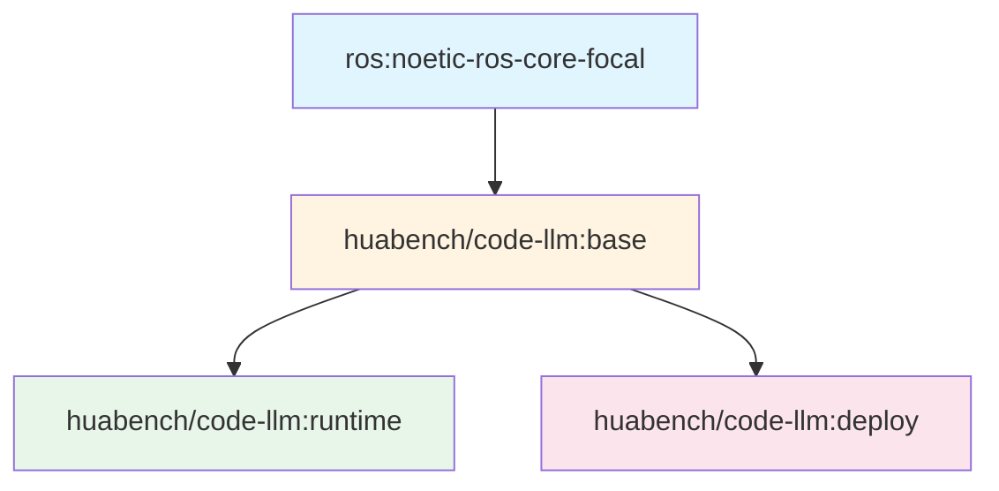

# Docker构建与运行完全指南

## 概述

本文档详细介绍GenSwarm项目的Docker镜像构建流程，从零开始讲解如何构建多阶段镜像、配置环境，以及如何运行容器完成代码生成和测试任务。

## 目录

1. [镜像架构](#镜像架构)
2. [前置准备](#前置准备)
3. [构建流程](#构建流程)
4. [运行容器](#运行容器)
5. [常用命令](#常用命令)
6. [故障排查](#故障排查)

---

## 镜像架构

GenSwarm采用**多阶段Docker镜像构建策略**，分为三个层次：



### 镜像层次说明

| 镜像 | 用途 | 基础镜像 | 关键组件 |
|------|------|---------|---------|
| **base** | 基础环境 | ros:noetic-ros-core-focal | ROS Noetic + Miniconda + Python |
| **runtime** | 代码生成运行环境 | huabench/code-llm:base | 完整依赖 + GenSwarm代码 |
| **deploy** | 真实硬件部署 | huabench/code-llm:base | Ansible + SSH工具 |

---

## 前置准备

### 1. 系统要求

- **操作系统**: Linux (x86_64 或 aarch64) / macOS / Windows with WSL2
- **Docker版本**: Docker Engine 20.10+ 或 Docker Desktop 4.0+
- **Docker Compose**: 2.0+
- **磁盘空间**: 至少 10GB 可用空间
- **内存**: 建议 8GB+

### 2. 安装Docker

#### Linux (Ubuntu/Debian)
```bash
# 安装Docker
curl -fsSL https://get.docker.com -o get-docker.sh
sudo sh get-docker.sh

# 将当前用户添加到docker组（避免每次使用sudo）
sudo usermod -aG docker $USER
newgrp docker

# 安装Docker Compose
sudo curl -L "https://github.com/docker/compose/releases/latest/download/docker-compose-$(uname -s)-$(uname -m)" -o /usr/local/bin/docker-compose
sudo chmod +x /usr/local/bin/docker-compose
```

#### macOS
```bash
# 使用Homebrew安装
brew install --cask docker

# 或下载Docker Desktop
# https://www.docker.com/products/docker-desktop
```

#### Windows (WSL2)
```bash
# 1. 安装WSL2: https://learn.microsoft.com/zh-cn/windows/wsl/install
# 2. 下载安装Docker Desktop: https://www.docker.com/products/docker-desktop
# 3. 在Docker Desktop设置中启用WSL2集成
```

### 3. 验证安装

```bash
# 检查Docker版本
docker --version
# 输出示例: Docker version 24.0.7, build afdd53b

# 检查Docker Compose版本
docker compose version
# 输出示例: Docker Compose version v2.23.0

# 测试Docker运行
docker run hello-world
```

### 4. 项目结构检查

确保你在GenSwarm项目根目录，并且有以下文件结构：

```
GenSwarm/
├── docker/
│   ├── base.Dockerfile          # 基础镜像定义
│   ├── runtime.Dockerfile       # 运行时镜像定义
│   ├── deploy.Dockerfile        # 部署镜像定义
│   ├── docker-compose.yml       # Docker Compose配置
│   └── ansible/                 # Ansible部署脚本
├── requirements.txt             # Python依赖列表
├── modules/                     # GenSwarm核心模块
├── run/                         # 运行脚本
└── config/                      # 配置文件
```

---

## 构建流程

### 阶段一：构建Base镜像 🏗️

**Base镜像**是所有其他镜像的基础，包含ROS Noetic和Miniconda。

#### 1.1 Dockerfile解析

```dockerfile
# docker/base.Dockerfile

# 基础镜像：ROS Noetic (Ubuntu 20.04)
FROM ros:noetic-ros-core-focal

# 安装基础工具
RUN apt-get update && \
    apt-get install -y python3-pip python3-rosdep python3-rospkg wget git && \
    rm -rf /var/lib/apt/lists/*

# 根据系统架构安装Miniconda (支持x86_64和aarch64)
RUN arch=$(uname -m) && \
    if [ "$arch" = "x86_64" ]; then \
        wget https://repo.anaconda.com/miniconda/Miniconda3-py39_4.10.3-Linux-x86_64.sh && \
        bash Miniconda3-py39_4.10.3-Linux-x86_64.sh -b -p /usr/local/miniconda && \
        rm Miniconda3-py39_4.10.3-Linux-x86_64.sh; \
    elif [ "$arch" = "aarch64" ]; then \
        wget https://repo.anaconda.com/miniconda/Miniconda3-py39_4.10.3-Linux-aarch64.sh && \
        bash Miniconda3-py39_4.10.3-Linux-aarch64.sh -b -p /usr/local/miniconda && \
        rm Miniconda3-py39_4.10.3-Linux-aarch64.sh; \
    fi

# 配置环境变量
ENV PATH="/usr/local/miniconda/bin:${PATH}"

# 配置bash环境
RUN echo "source /usr/local/miniconda/etc/profile.d/conda.sh" >> ~/.bashrc \
    && echo 'export ROS_MASTER_URI=http://$(hostname):11311' >> ~/.bashrc \
    && echo "source /opt/ros/noetic/setup.bash" >> ~/.bashrc
```

**关键点**：
- ✅ 支持多架构（x86_64 和 aarch64）
- ✅ 预配置ROS环境
- ✅ 清理apt缓存减小镜像大小

#### 1.2 构建Base镜像

```bash
# 进入docker目录
cd docker

# 方法1：使用docker compose构建（推荐）
docker compose build base

# 方法2：使用docker build命令
docker build -t huabench/code-llm:base -f base.Dockerfile .

# 验证镜像构建成功
docker images | grep "code-llm"
# 输出示例：
# huabench/code-llm   base      abc123def456   5 minutes ago   2.5GB
```

**构建时间**: 约 5-10 分钟（取决于网络速度）

---

### 阶段二：构建Runtime镜像 🚀

**Runtime镜像**在Base基础上安装所有Python依赖，这是主要的工作环境。

#### 2.1 Dockerfile解析

```dockerfile
# docker/runtime.Dockerfile

FROM huabench/code-llm:base

ARG PYTHON_VERSION=3.10
ENV DEBIAN_FRONTEND=noninteractive

WORKDIR /catkin_ws

# 创建Python 3.10 conda环境
RUN conda create -y --name py310 python=${PYTHON_VERSION}

# 激活conda环境
SHELL ["/bin/bash", "-c"]
RUN echo "conda activate py310" >> ~/.bashrc

# 复制依赖列表
COPY requirements.txt requirements.txt

# 安装系统依赖
RUN apt-get update && apt-get install -y \
    swig \                      # SWIG接口生成器
    python3-empy \              # Python模板引擎
    libgl1-mesa-glx \           # OpenGL库（OpenCV需要）
    iputils-ping \              # 网络工具
    apt-transport-https \       # HTTPS传输
    ca-certificates \           # CA证书
    curl \                      # 下载工具
    software-properties-common \ # 软件源管理
    lsb-release \               # LSB信息
    openssh-client \            # SSH客户端
    ansible \                   # 自动化工具
    sshpass \                   # SSH密码工具
    && rm -rf /var/lib/apt/lists/*

# 安装Python依赖
RUN /bin/bash -c "source activate py310 && \
                  pip3 install --no-cache-dir -r requirements.txt && \
                  pip3 install httpx==0.27.0 && \
                  conda install -y -c conda-forge empy"

# 配置Ansible
RUN printf '[defaults]\nhost_key_checking = False\n' > /etc/ansible/ansible.cfg

# 设置Python路径
ENV PYTHONPATH=/catkin_ws/src/code_llm
```

**关键依赖**：

| 依赖类别 | 主要包 | 用途 |
|---------|--------|------|
| **LLM相关** | openai, dashscope, anthropic | LLM API调用 |
| **科学计算** | numpy, scipy, matplotlib | 数值计算和可视化 |
| **机器人** | rospkg, rospy_message_converter | ROS集成 |
| **仿真** | gymnasium, box2d-py, pygame | 仿真环境 |
| **图像处理** | opencv-python, pillow, imageio | 视觉处理 |
| **工具** | pydantic, PyYAML, loguru | 数据验证和日志 |

#### 2.2 构建Runtime镜像

```bash
# 回到项目根目录（重要！）
cd ..

# 方法1：使用docker compose构建（推荐）
docker compose -f docker/docker-compose.yml build runtime-base

# 方法2：使用docker build命令
docker build -t huabench/code-llm:runtime -f docker/runtime.Dockerfile .

# 验证镜像
docker images | grep "code-llm"
# 输出示例：
# huabench/code-llm   runtime   def456abc789   10 minutes ago   4.5GB
# huabench/code-llm   base      abc123def456   20 minutes ago   2.5GB
```

**构建时间**: 约 10-20 分钟（取决于网络速度和依赖下载）

**常见问题**：
- ⚠️ 如果遇到 `pip install` 超时，可以设置国内镜像源：
  ```bash
  # 临时使用清华镜像
  pip install -i https://pypi.tuna.tsinghua.edu.cn/simple -r requirements.txt
  ```

---

### 阶段三：构建Deploy镜像 📦

**Deploy镜像**用于将代码部署到真实机器人硬件。

#### 3.1 Dockerfile解析

```dockerfile
# docker/deploy.Dockerfile

FROM huabench/code-llm:base

# 安装部署工具
RUN apt-get update \
    && apt-get install -y \
        libgl1-mesa-glx \       # OpenGL支持
        openssh-client \        # SSH客户端
        iputils-ping \          # ping工具
        ansible \               # 自动化部署
        sshpass \               # SSH密码认证
    && pip install ansible \
       numpy \
       rospy_message_converter

WORKDIR /src

# 配置Ansible
RUN mkdir -p /etc/ansible
RUN printf '[defaults]\nhost_key_checking = False\n' > /etc/ansible/ansible.cfg
```

#### 3.2 构建Deploy镜像

```bash
# 使用docker compose构建
docker compose -f docker/docker-compose.yml build deploy

# 或使用docker build
docker build -t huabench/code-llm:deploy -f docker/deploy.Dockerfile .
```

**构建时间**: 约 5 分钟

---

### 一键构建所有镜像 🎯

```bash
# 从项目根目录执行
cd /path/to/GenSwarm

# 构建所有镜像
docker compose -f docker/docker-compose.yml build

# 查看构建结果
docker images | grep "code-llm"
# 输出示例：
# huabench/code-llm   deploy    ghi789abc123   2 minutes ago    2.8GB
# huabench/code-llm   runtime   def456abc789   15 minutes ago   4.5GB
# huabench/code-llm   base      abc123def456   25 minutes ago   2.5GB
```

**总构建时间**: 约 20-30 分钟

---

## 运行容器

### 运行方式一：Runtime容器（代码生成与仿真）⭐

这是最常用的运行方式，用于执行代码生成和仿真验证任务。

#### 4.1 启动交互式容器

```bash
# 进入docker目录
cd docker

# 启动runtime容器（推荐方式）
docker compose run runtime-base

# 容器内会自动挂载项目代码到 /catkin_ws/src/code_llm
# 并激活py310 conda环境
```

**容器内环境**：
```bash
# 你会看到提示符变成：
(py310) root@hostname:/catkin_ws#

# 验证环境
python --version
# 输出: Python 3.10.x

# 验证ROS
echo $ROS_DISTRO
# 输出: noetic

# 验证GenSwarm模块
cd src/code_llm
python -c "from modules.framework.workflow import Workflow; print('✓ GenSwarm imported')"
```

#### 4.2 运行代码生成任务

```bash
# 在容器内执行

# 切换到项目目录
cd /catkin_ws/src/code_llm

# 运行单个任务
python run/run_single.py \
    --llm_name gpt-4 \
    --run_experiment_name flocking \
    --test_mode debug

# 运行批量任务
python run/run_batch.py \
    --llm_name gpt-4 \
    --prompt_type CoT \
    --test_mode full_version

# 运行大规模批量任务
python run/run_batch_large.py \
    --llm_names gpt-4,claude-3 \
    --prompt_types CoT,ReAct \
    --run_experiment_names flocking,covering,encircling
```

#### 4.3 挂载卷说明

Runtime容器使用Docker卷挂载，实现**代码实时同步**：

```yaml
# docker-compose.yml
volumes:
  - ..:/catkin_ws/src/code_llm
```

**这意味着**：
- ✅ 宿主机修改代码，容器内立即生效（无需重启）
- ✅ 容器内生成的结果，自动保存到宿主机
- ✅ 工作空间(`workspace/`)持久化

---

### 运行方式二：Deploy容器（真实硬件部署）

用于将验证通过的代码部署到真实机器人。

#### 5.1 配置机器人主机

编辑 `config/hosts` 文件：

```ini
# config/hosts
[robots]
robot1 ansible_host=192.168.1.101 ansible_user=ubuntu ansible_password=yourpassword
robot2 ansible_host=192.168.1.102 ansible_user=ubuntu ansible_password=yourpassword
robot3 ansible_host=192.168.1.103 ansible_user=ubuntu ansible_password=yourpassword

[robots:vars]
ansible_python_interpreter=/usr/bin/python3
```

#### 5.2 执行部署

```bash
# 设置环境变量
export DATA_PATH="gpt4/flocking/2024-01-15"
export STAGE=0  # 0=prepare, 1=run, 2=finish

# 运行部署容器
docker compose -f docker/docker-compose.yml up deploy

# 或分阶段执行
export STAGE=0 && docker compose up deploy  # 准备阶段
export STAGE=1 && docker compose up deploy  # 运行阶段
export STAGE=2 && docker compose up deploy  # 清理阶段
```

**部署流程**：
1. **Stage 0 (Prepare)**: 复制代码到机器人，构建Docker镜像
2. **Stage 1 (Run)**: 启动容器，执行控制代码
3. **Stage 2 (Finish)**: 停止容器，收集日志

---

### 运行方式三：单元测试

```bash
# 运行所有单元测试
docker compose -f docker/docker-compose.yml up unittest

# 或进入容器手动运行
docker compose run runtime-base

# 容器内执行
cd /catkin_ws/src/code_llm
conda activate py310
python -m unittest discover tests
```

---

## 常用命令

### 镜像管理

```bash
# 查看所有镜像
docker images

# 删除镜像
docker rmi huabench/code-llm:runtime

# 清理悬空镜像（释放空间）
docker image prune -f

# 清理所有未使用镜像
docker image prune -a -f

# 查看镜像构建历史
docker history huabench/code-llm:runtime
```

### 容器管理

```bash
# 查看运行中的容器
docker ps

# 查看所有容器（包括停止的）
docker ps -a

# 停止容器
docker stop <container_id>

# 删除容器
docker rm <container_id>

# 清理所有停止的容器
docker container prune -f

# 进入运行中的容器
docker exec -it <container_id> /bin/bash
```

### Docker Compose命令

```bash
# 启动服务（前台）
docker compose -f docker/docker-compose.yml up runtime-base

# 启动服务（后台）
docker compose -f docker/docker-compose.yml up -d runtime-base

# 停止服务
docker compose -f docker/docker-compose.yml down

# 查看服务日志
docker compose -f docker/docker-compose.yml logs -f runtime-base

# 重新构建并启动
docker compose -f docker/docker-compose.yml up --build runtime-base

# 进入服务容器
docker compose -f docker/docker-compose.yml exec runtime-base /bin/bash
```

### 数据卷管理

```bash
# 查看所有数据卷
docker volume ls

# 删除数据卷
docker volume rm <volume_name>

# 清理未使用的数据卷
docker volume prune -f
```

---

## 故障排查

### 问题1：构建失败 - 网络超时

**症状**：
```
ERROR: failed to solve: failed to fetch https://...
```

**解决方案**：
```bash
# 配置Docker使用国内镜像源
sudo mkdir -p /etc/docker
sudo tee /etc/docker/daemon.json <<-'EOF'
{
  "registry-mirrors": [
    "https://docker.mirrors.ustc.edu.cn",
    "https://hub-mirror.c.163.com"
  ]
}
EOF

sudo systemctl daemon-reload
sudo systemctl restart docker

# 重新构建
docker compose build
```

### 问题2：pip安装超时

**症状**：
```
ERROR: Could not install packages due to an EnvironmentError: ReadTimeoutError
```

**解决方案**：
修改 `docker/runtime.Dockerfile`，添加pip国内源：
```dockerfile
RUN /bin/bash -c "source activate py310 && \
                  pip3 install -i https://pypi.tuna.tsinghua.edu.cn/simple \
                  --no-cache-dir -r requirements.txt"
```

### 问题3：磁盘空间不足

**症状**：
```
ERROR: failed to solve: no space left on device
```

**解决方案**：
```bash
# 清理Docker缓存
docker system prune -a -f

# 查看空间占用
docker system df

# 删除未使用的镜像、容器、网络
docker system prune -a --volumes -f
```

### 问题4：权限问题

**症状**：
```
permission denied while trying to connect to the Docker daemon socket
```

**解决方案**：
```bash
# 将用户添加到docker组
sudo usermod -aG docker $USER

# 重新登录或执行
newgrp docker

# 验证
docker run hello-world
```

### 问题5：容器内无法访问代码

**症状**：
容器启动后 `/catkin_ws/src/code_llm` 目录为空

**解决方案**：
```bash
# 确保从项目根目录启动
cd /path/to/GenSwarm
docker compose -f docker/docker-compose.yml run runtime-base

# 检查docker-compose.yml中的volumes配置
# 应该是相对路径: ..:/catkin_ws/src/code_llm
```

### 问题6：ROS环境未激活

**症状**：
```bash
roscore: command not found
```

**解决方案**：
```bash
# 在容器内执行
source /opt/ros/noetic/setup.bash

# 或将其添加到.bashrc（已在Dockerfile中配置）
source ~/.bashrc
```

### 问题7：conda环境未激活

**症状**：
```bash
python --version
# 输出: Python 3.8.x (应该是3.10.x)
```

**解决方案**：
```bash
# 手动激活
conda activate py310

# 验证
python --version
# 输出: Python 3.10.x
```

### 问题8：CMake构建缓存冲突

**症状**：
```
CMake Error: The source directory does not match the binary directory
```

**解决方案**：
```bash
# 创建.dockerignore文件（如果不存在）
cat > .dockerignore <<EOF
build/
devel/
.catkin_workspace
*.pyc
__pycache__/
.git/
.idea/
.vscode/
workspace/
EOF

# 清理本地构建产物
rm -rf build/ devel/ .catkin_workspace

# 重新构建镜像
docker compose build --no-cache runtime-base
```

---

## 最佳实践

### 1. 开发工作流

```bash
# 1. 启动容器（在docker目录下）
cd docker
docker compose run runtime-base

# 2. 在容器内开发和测试
cd /catkin_ws/src/code_llm
python run/run_single.py --llm_name gpt-4 --run_experiment_name flocking

# 3. 在宿主机编辑代码（使用你喜欢的IDE）
# 修改会立即同步到容器内

# 4. 退出容器
exit

# 5. 提交代码
git add .
git commit -m "Add new feature"
```

### 2. 镜像版本管理

```bash
# 标记版本
docker tag huabench/code-llm:runtime huabench/code-llm:runtime-v1.0.0

# 推送到Docker Hub（可选）
docker login
docker push huabench/code-llm:runtime-v1.0.0
```

### 3. 定期清理

```bash
# 每周清理一次
docker system prune -a -f

# 保留最近的镜像
docker images | grep "code-llm" | awk '{print $3}' | tail -n +3 | xargs docker rmi
```

### 4. 性能优化

```bash
# 使用BuildKit加速构建
export DOCKER_BUILDKIT=1
docker compose build

# 并行构建多个镜像
docker compose build --parallel
```

---

## 快速参考

### 完整构建与运行流程

```bash
# 1. 克隆项目
git clone https://github.com/your-org/GenSwarm.git
cd GenSwarm

# 2. 构建所有镜像
docker compose -f docker/docker-compose.yml build

# 3. 启动runtime容器
cd docker
docker compose run runtime-base

# 4. 在容器内运行代码生成
cd /catkin_ws/src/code_llm
python run/run_single.py \
    --llm_name gpt-4 \
    --run_experiment_name flocking \
    --test_mode debug

# 5. 查看结果
ls workspace/gpt4/flocking/
```

### 环境变量

| 变量 | 说明 | 默认值 |
|------|------|--------|
| `PYTHON_VERSION` | Python版本 | 3.10 |
| `PYTHONPATH` | Python模块路径 | /catkin_ws/src/code_llm |
| `ROS_MASTER_URI` | ROS主节点URI | http://$(hostname):11311 |
| `DATA_PATH` | 部署数据路径 | 无 |
| `STAGE` | 部署阶段(0/1/2) | 无 |

### 常用端口

| 端口 | 服务 | 说明 |
|------|------|------|
| 11311 | ROS Master | ROS核心服务 |
| 22 | SSH | 远程部署连接 |

---

## 总结

本文档详细介绍了GenSwarm项目的Docker构建和运行流程：

1. ✅ **多阶段镜像**: base → runtime → deploy
2. ✅ **预编译策略**: 所有依赖在镜像构建时完成
3. ✅ **卷挂载**: 实现代码实时同步
4. ✅ **环境隔离**: Conda环境 + Docker容器
5. ✅ **自动化部署**: Ansible + Docker Compose

**核心命令回顾**：
```bash
# 构建镜像
docker compose -f docker/docker-compose.yml build

# 运行容器
cd docker && docker compose run runtime-base

# 执行代码生成
python run/run_single.py --llm_name gpt-4 --run_experiment_name flocking
```

如有问题，请参考[故障排查](#故障排查)章节或提交Issue。
