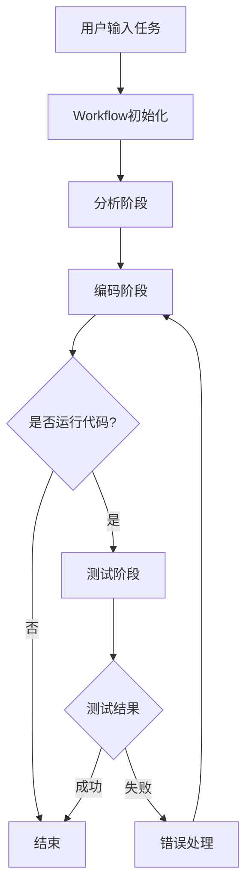
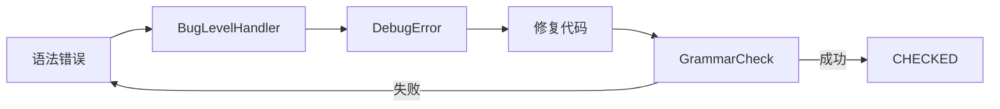

# 工作流程详解

## 概述

本章详细介绍GenSwarm系统从接收用户指令到生成可执行代码的完整工作流程，展示各模块如何协作完成自动化代码生成任务。

## 整体架构



## 流程启动

### 1. 入口点（run_single.py）

```python
# run/run_single.py

import asyncio
from modules.framework.workflow import Workflow
from modules.prompt import get_user_commands

# 解析命令行参数
args = parse_arguments()

# 获取任务描述
task = get_user_commands(experiment_name)[0]

# 创建并运行工作流
workflow = Workflow(task, args=args)
await workflow.run()
```

**参数说明**：
- `task`: 用户任务描述（如"让机器人形成圆形编队"）
- `args`: 包含配置参数（LLM模型、任务类型、运行模式等）

### 2. Workflow初始化

```python
# modules/framework/workflow.py

class Workflow:
    def __init__(self, user_command: str, args=None):
        # 1. 创建全局上下文（单例）
        self._context = WorkflowContext(args=args)
        self._context.command = user_command
        
        # 2. 设置上下文给所有ActionNode
        ActionNode.context = self._context
        
        # 3. 初始化工作空间
        self.init_workspace()
        
        # 4. 设置日志文件
        self.init_log_file()
        
        # 5. 构建工作流管道
        self.build_up()
```

**工作空间初始化**：
```python
def init_workspace():
    # 创建目录结构
    workspace_root/
    ├── data/
    │   └── frames/      # 视频帧
    ├── apis.py          # 局部API（复制）
    ├── global_apis.py   # 全局API（复制）
    ├── run.py           # 运行脚本模板（复制）
    └── allocate_run.py  # 分配脚本模板（复制）
```

### 3. 构建工作流管道

```python
def build_up(self):
    # === 初始化Actions ===
    analyze_constraints = AnalyzeConstraints("constraint pool")
    analyze_functions = AnalyzeSkills("function pool")
    generate_functions = GenerateFunctions(run_mode="layer")
    run_code = RunCodeAsync("pass")
    debug_code = DebugError("fixed code")
    code_improver = CodeImprove("feedback")
    video_critic = VideoCriticize("")
    
    # === 初始化错误处理链 ===
    bug_handler = BugLevelHandler()
    bug_handler.next_action = debug_code
    debug_code._next = run_code
    
    hf_handler = FeedbackHandler()
    hf_handler.next_action = code_improver
    code_improver._next = run_code
    
    bug_handler.successor = hf_handler
    
    # === 设置错误处理器 ===
    run_code.error_handler = bug_handler
    video_critic.error_handler = bug_handler
    
    # === 链接Actions ===
    # Stage 1: 分析阶段
    analysis_stage = ActionLinkedList("Analysis", analyze_constraints)
    analysis_stage.add(analyze_functions)
    
    # Stage 2: 编码阶段
    coding_stage = ActionLinkedList("Coding", generate_functions)
    
    # Stage 3: 测试阶段
    test_stage = ActionLinkedList("Testing", run_code)
    test_stage.add(video_critic)
    
    # === 组合所有阶段 ===
    code_llm = ActionLinkedList("Code-LLM", analysis_stage)
    code_llm.add(coding_stage)
    if self._run_code:
        code_llm.add(test_stage)
    code_llm.add(ActionNode("PASS", "END"))
    
    self._pipeline = code_llm
```

## 阶段一：分析阶段（Analysis）

### 步骤1：约束分析（AnalyzeConstraints）

**目标**：从用户指令中提取约束条件

```python
class AnalyzeConstraints(ActionNode):
    def _build_prompt(self):
        self.prompt = ANALYZE_CONSTRAINT_PROMPT_TEMPLATE.format(
            task_des=TASK_DES,                    # 任务类型描述
            instruction=self.context.command,      # 用户指令
            global_api=self.context.global_robot_api,  # 全局API
            local_api=self.context.local_robot_api,    # 局部API
            env_des=ENV_DES,                      # 环境描述
            output_template=CONSTRAIN_TEMPLATE,    # 输出格式
            user_constraints=json.dumps(existing)  # 已有约束
        )
    
    async def _process_response(self, response: str):
        # 解析JSON响应
        content = parse_text(response, "json")
        
        # 初始化约束池
        self.context.constraint_pool.init_constraints(content)
        
        logger.log("Analyze Constraints Success", "success")
```

**输入示例**：
```
User Instruction: 让20个机器人形成圆形编队，保持安全距离
```

**LLM输出示例**：
```json
{
    "constraints": [
        {
            "id": "C1",
            "description": "机器人应均匀分布在圆周上",
            "type": "formation",
            "priority": "high"
        },
        {
            "id": "C2",
            "description": "相邻机器人间距不少于0.3米",
            "type": "safety",
            "priority": "high"
        }
    ]
}
```

**结果**：约束存储在 `context.constraint_pool`

### 步骤2：技能分析（AnalyzeSkills）

**目标**：将任务分解为函数列表

```python
class AnalyzeSkills(ActionNode):
    def _build_prompt(self):
        self.prompt = ANALYZE_SKILL_PROMPT_TEMPLATE.format(
            task_des=TASK_DES,
            instruction=self.context.command,
            local_api=self.context.local_robot_api,
            global_api=self.context.global_robot_api,
            env_des=ENV_DES,
            constraints=str(self.context.constraint_pool),  # 使用上一步的约束
            output_template=FUNCTION_TEMPLATE,
        )
    
    async def _process_response(self, response: str):
        content = parse_text(response, "json")
        functions = eval(content)["functions"]
        
        # 分类为全局和局部函数
        global_functions = [f for f in functions if f["scope"] == "global"]
        local_functions = [f for f in functions if f["scope"] == "local"]
        
        # 初始化函数树
        self.context.global_skill_tree.init_functions(global_functions)
        self.context.local_skill_tree.init_functions(local_functions)
        
        # 检查约束覆盖
        self.context.constraint_pool.check_constraints_satisfaction()
```

**LLM输出示例**：
```json
{
    "functions": [
        {
            "name": "calculate_circle_positions",
            "scope": "global",
            "description": "计算圆形编队中每个机器人的目标位置",
            "inputs": ["num_robots", "circle_radius", "circle_center"],
            "outputs": ["target_positions"],
            "dependencies": []
        },
        {
            "name": "allocate_positions",
            "scope": "global",
            "description": "将目标位置分配给各个机器人",
            "inputs": ["target_positions", "robot_states"],
            "outputs": ["task_allocation"],
            "dependencies": ["calculate_circle_positions"]
        },
        {
            "name": "move_to_target",
            "scope": "local",
            "description": "控制机器人移动到目标位置",
            "inputs": ["target_position", "current_state"],
            "outputs": ["velocity"],
            "dependencies": []
        },
        {
            "name": "maintain_formation",
            "scope": "local",
            "description": "保持编队并避免碰撞",
            "inputs": ["target_position", "neighbors"],
            "outputs": ["adjusted_velocity"],
            "dependencies": ["move_to_target"]
        }
    ]
}
```

**结果**：
- 全局函数存储在 `context.global_skill_tree`
- 局部函数存储在 `context.local_skill_tree`
- 函数树自动构建依赖关系

## 阶段二：编码阶段（Coding）

### GenerateFunctions 协调器

```python
class GenerateFunctions(ActionNode):
    def __init__(self, run_mode="layer"):
        # 创建子流程
        design_functions = DesignFunctionAsync(skill_tree, run_mode)
        write_functions = WriteFunctionsAsync(skill_tree, run_mode)
        grammar_check = GrammarCheckAsync(skill_tree, run_mode)
        code_review = CodeReviewAsync(skill_tree, run_mode)
        write_run = WriteRun(skill_tree)
        
        # 组装子流程
        self._actions = ActionLinkedList("Generate Functions", design_functions)
        self._actions.add(write_functions)
        self._actions.add(code_review)
        self._actions.add(grammar_check)
        
        self._write_run = ActionLinkedList("Write Run", write_run)
    
    async def _run(self):
        # 循环处理每一层，直到所有函数都CHECKED
        finish = False
        while not finish:
            await self._actions.run_internal_actions()
            finish = all(node.state == State.CHECKED for node in self.skill_tree.nodes)
        
        # 生成运行脚本
        await self._write_run.run_internal_actions()
        
        # 切换作用域（global → local）
        if self.context.scoop == "global":
            self.context.scoop = "local"
            self._next = GenerateFunctions()
```

### 步骤1：设计函数（DesignFunctionAsync）

**目标**：为每个函数设计伪代码

```python
class DesignFunctionAsync(AsyncNode):
    async def operate(self, function_node):
        """为单个函数设计伪代码"""
        # 构建提示词
        prompt = DESIGN_FUNCTION_PROMPT_TEMPLATE.format(
            function_info=function_node.to_dict(),
            all_functions=self.skill_tree.to_string(),
            constraints=str(self.constraint_pool),
            global_api=self.context.global_robot_api,
        )
        
        # 调用LLM
        llm = GPT(model_name=self.context.args.llm_name)
        pseudocode = await llm.ask(prompt)
        
        # 保存伪代码
        function_node.pseudocode = pseudocode
        function_node.state = State.DESIGNED
        
        logger.log(f"Designed function: {function_node.name}", "info")
```

**处理模式**：

#### Layer模式（推荐）
按依赖层级处理，同一层的函数可并行设计：

```python
# Layer 0: 无依赖的函数（并行）
[calculate_circle_positions] → DESIGNED

# Layer 1: 依赖Layer 0（并行）
[allocate_positions] → DESIGNED

# Layer 2: 依赖Layer 1（并行）
[move_to_target, maintain_formation] → DESIGNED
```

**LLM输出示例（伪代码）**：
```python
"""
Function: calculate_circle_positions

Pseudocode:
1. Get circle parameters (radius, center)
2. Calculate angular step: step = 2π / num_robots
3. For each robot i:
   a. angle = i * step
   b. x = center.x + radius * cos(angle)
   c. y = center.y + radius * sin(angle)
   d. target_positions[i] = (x, y)
4. Return target_positions
"""
```

### 步骤2：编写函数（WriteFunctionsAsync）

**目标**：将伪代码转换为Python代码

```python
class WriteFunctionsAsync(AsyncNode):
    async def operate(self, function_node):
        # 构建提示词（包含伪代码）
        prompt = WRITE_FUNCTION_PROMPT_TEMPLATE.format(
            function_info=function_node.to_dict(),
            pseudocode=function_node.pseudocode,
            global_api=self.context.global_robot_api,
            existing_functions=self._get_existing_code(),
        )
        
        # 调用LLM生成代码
        llm = GPT(model_name=self.context.args.llm_name)
        code = await llm.ask(prompt)
        
        # 解析代码
        code = parse_text(code, "python")
        
        # 保存代码
        function_node.code = code
        function_node.state = State.WRITTEN
        
        # 更新文件
        self.skill_tree.file.message = self._assemble_all_code()
```

**LLM输出示例（Python代码）**：
```python
def calculate_circle_positions(num_robots: int, circle_radius: float, 
                               circle_center: np.ndarray) -> np.ndarray:
    """
    计算圆形编队中每个机器人的目标位置
    
    Args:
        num_robots: 机器人数量
        circle_radius: 圆形半径
        circle_center: 圆心位置 [x, y]
    
    Returns:
        目标位置数组，形状为 (num_robots, 2)
    """
    target_positions = np.zeros((num_robots, 2))
    angular_step = 2 * np.pi / num_robots
    
    for i in range(num_robots):
        angle = i * angular_step
        x = circle_center[0] + circle_radius * np.cos(angle)
        y = circle_center[1] + circle_radius * np.sin(angle)
        target_positions[i] = [x, y]
    
    return target_positions
```

### 步骤3：代码审查（CodeReviewAsync）

**目标**：检查代码质量和逻辑正确性

```python
class CodeReviewAsync(AsyncNode):
    async def operate(self, function_node):
        prompt = CODE_REVIEW_PROMPT_TEMPLATE.format(
            function_code=function_node.code,
            function_info=function_node.to_dict(),
        )
        
        llm = GPT(model_name=self.context.args.llm_name)
        review_result = await llm.ask(prompt)
        
        # 解析审查结果
        result = parse_text(review_result, "json")
        
        if result["status"] == "PASS":
            function_node.state = State.REVIEWED
            logger.log(f"Review passed: {function_node.name}", "success")
        else:
            # 记录问题，可能触发重写
            function_node.review_issues = result["issues"]
            logger.log(f"Review found issues: {function_node.name}", "warning")
```

### 步骤4：语法检查（GrammarCheckAsync）

**目标**：验证代码语法正确性

```python
class GrammarCheckAsync(AsyncNode):
    async def operate(self, function_node):
        try:
            # 使用Python AST检查语法
            ast.parse(function_node.code)
            
            function_node.state = State.CHECKED
            logger.log(f"Grammar check passed: {function_node.name}", "success")
            
        except SyntaxError as e:
            # 创建错误对象
            error = Bug(
                error_message=str(e),
                error_code=function_node.code,
                error_line=e.lineno
            )
            
            # 触发错误处理链
            if self.error_handler:
                next_action = self.error_handler.handle(error)
                await next_action.run()
```

**错误处理流程**：



### 步骤5：生成运行脚本（WriteRun）

**目标**：生成多机器人协调的主运行脚本

```python
class WriteRun(ActionNode):
    def _build_prompt(self):
        # 全局作用域：生成allocate_run.py
        if self.context.scoop == "global":
            self.prompt = WRITE_GLOBAL_RUN_PROMPT_TEMPLATE.format(
                all_global_functions=self.skill_tree.get_all_code(),
                allocator_template=ALLOCATOR_TEMPLATE,
            )
        # 局部作用域：生成run.py
        else:
            self.prompt = WRITE_LOCAL_RUN_PROMPT_TEMPLATE.format(
                all_local_functions=self.skill_tree.get_all_code(),
            )
    
    async def _process_response(self, response: str):
        code = parse_text(response, "python")
        
        # 保存运行脚本
        if self.context.scoop == "global":
            file = File(name="allocate_run.py")
        else:
            file = File(name="run.py")
        
        file.message = code
        
        self.context.run_code = file
```

**生成的allocate_run.py示例**：
```python
from global_apis import *

def allocate_tasks():
    # 获取所有机器人状态
    robot_states = get_all_robot_states()
    num_robots = len(robot_states)
    
    # 计算圆形编队位置
    circle_center = np.array([0.0, 0.0])
    circle_radius = 3.0
    target_positions = calculate_circle_positions(num_robots, circle_radius, circle_center)
    
    # 分配位置给各机器人
    allocation = allocate_positions(target_positions, robot_states)
    
    # 发布分配结果
    for robot_id, target_pos in enumerate(allocation):
        assign_task(robot_id, {"target_position": target_pos})
    
    return allocation

if __name__ == '__main__':
    rospy.init_node('task_allocator')
    allocate_tasks()
```

**生成的run.py示例**：
```python
from apis import *

def main():
    # 初始化ROS
    initialize_ros_node()
    
    # 获取分配的任务
    task = get_assigned_task()
    target_position = np.array(task["target_position"])
    
    # 控制循环
    rate = rospy.Rate(10)  # 10Hz
    while not rospy.is_shutdown():
        # 获取状态
        robot_state = get_robot_state()
        neighbors = get_neighbors(radius=2.0)
        
        # 移动到目标
        velocity = move_to_target(target_position, robot_state)
        
        # 保持编队
        adjusted_vel = maintain_formation(target_position, neighbors)
        
        # 发布速度
        publish_velocity(adjusted_vel[0], adjusted_vel[1])
        
        rate.sleep()

if __name__ == '__main__':
    main()
```

## 阶段三:测试阶段(Testing)

测试阶段包含多种运行和验证方式,根据不同的部署场景使用不同的RunCode类。

### RunCode类型概览

GenSwarm提供了**4种不同的RunCode实现**,它们分别对应不同的验证和部署需求:

| 类名 | 用途 | 环境 | 执行方式 | 调用时机 |
|------|------|------|---------|----------|
| **RunCodeAsync** | 仿真验证(多机器人并行) | Gymnasium + QuadTreeEngine | 异步并行执行多个RunCode | 主要测试流程 |
| **RunAllocateRun** | 全局任务分配验证 | Gymnasium + QuadTreeEngine | 执行allocate_run.py | 仅当有全局函数时 |
| **RunCode** | 单机器人批次执行 | Gymnasium + QuadTreeEngine | 执行run.py(单进程) | 被RunCodeAsync调用 |
| **RunCodeReal** | 真实硬件部署 | 真实机器人硬件 | Docker+Ansible部署 | 仿真通过后可选 |

### 1. RunCodeAsync - 主要仿真验证流程 ⭐

**核心定位**:测试阶段的主要入口,负责并行执行多机器人仿真验证。

**执行流程**:

```python
class RunCodeAsync(ActionNode):
    """主要仿真验证类 - 并行执行多机器人仿真"""
    
    async def _run(self):
        self.call_times += 1
        self.context.scoop = "local"  # 切换到局部作用域
        
        # 1. 获取机器人范围
        start_idx = rospy.get_param("robot_start_index")  # 例如:0
        end_idx = rospy.get_param("robot_end_index")      # 例如:19
        total_robots = end_idx - start_idx + 1            # 共20个机器人
        
        # 2. 分块策略:将机器人分成多个批次并行处理
        num_processes = min(10, total_robots)  # 最多10个并行进程
        robots_per_process = total_robots // num_processes
        
        # 示例:20个机器人 → 10个进程,每进程2个机器人
        # Chunk 0: [0, 1]
        # Chunk 1: [2, 3]
        # ...
        # Chunk 9: [18, 19]
        robot_ids = list(range(start_idx, end_idx + 1))
        robot_id_chunks = [
            robot_ids[i: i + robots_per_process]
            for i in range(0, total_robots, robots_per_process)
        ]
        
        try:
            # 3. 启动仿真环境(QuadTreeEngine)
            keep_entities = len(self.context.global_skill_tree.layers) > 0
            self.env.start_environment(
                experiment_path=root_manager.workspace_root,
                keep_entities=keep_entities  # 是否保留全局实体
            )
            
            # 4. 创建并行任务:每个chunk对应一个RunCode实例
            tasks = []
            for chunk in robot_id_chunks:
                action = RunCode()  # 创建RunCode实例
                action.setup(chunk[0], chunk[-1])  # 设置机器人ID范围
                task = asyncio.create_task(action.run())  # 异步执行
                tasks.append(task)
            
            # 5. 等待所有并行任务完成
            result_list = list(set(await asyncio.gather(*tasks)))
            # result_list示例: ["NONE", "NONE", ...] 或 ["Error: ...", "NONE", ...]
            
        except Exception as e:
            logger.log(f"Error in RunCodeAsync: {e}", "error")
            result_list = [str(e)]
            
        finally:
            # 6. 清理进程
            os.system(f"pgrep -f run.py | xargs kill -9")
            return self._process_response(result_list)
```

**结果处理**:
```python
def _process_response(self, result: list):
    """处理并行执行结果"""
    dict_result = {
        "run_times": self.call_times,
        "result": result,
        'test_mode': run_args.test_mode,
    }
    
    try:
        # 1. 保存上下文
        self.context.save_to_file(root_manager.workspace_root / f"{run_args.test_mode}.pkl")
        
        # 2. 停止环境并保存数据
        self.env.stop_environment(file_name=run_args.test_mode)
        
        # 3. 检查所有结果
        if all(item in ["NONE", "Timeout"] for item in result):
            # 所有进程都成功
            logger.log("Run code success", "success")
            return "NONE"
        
        # 4. 有错误发生
        result = [item for item in result if item not in ["NONE", "Timeout"]]
        logger.log(f"Run code failed, result: {result}", "error")
        
        result_content = result[0]  # 取第一个错误
        
        # 5. 重试逻辑
        if self.call_times >= 3:
            logger.log(f"Run code failed {self.call_times} times", "warning")
            return str(dict_result)
        
        # 6. 创建Bug对象触发错误处理
        if run_args.test_mode in ["debug", "full_version"]:
            return Bug(
                error_msg=result_content,
                error_code="\n\n".join(self.context.local_skill_tree.functions_body),
                error_function="",
            )
    
    finally:
        # 7. 保存运行结果到JSON
        save_dict_to_json(
            dict_result,
            root_manager.workspace_root / f"{run_args.test_mode}_local_run.json"
        )
```

**关键特性**:
- ✅ **并行执行**:使用asyncio同时运行多个RunCode实例
- ✅ **容错处理**:收集所有错误,触发调试流程
- ✅ **状态保存**:每次运行后保存上下文到.pkl文件
- ✅ **重试机制**:失败后最多重试3次
- ✅ **数据记录**:保存运行结果到JSON文件

---

### 2. RunAllocateRun - 全局任务分配验证

**核心定位**:验证全局函数生成的allocate_run.py脚本。

**使用场景**:
- 仅当 `context.global_skill_tree.layers` 不为空时执行
- 用于验证全局协调逻辑(如任务分配、路径规划等)

**执行流程**:

```python
class RunAllocateRun(ActionNode):
    """全局任务分配验证类 - 执行allocate_run.py"""
    
    async def _run(self):
        self.call_times += 1
        
        try:
            # 1. 切换到全局作用域
            self.context.scoop = "global"
            
            # 2. 检查是否有全局任务
            if len(self.context.global_skill_tree.layers) == 0:
                logger.log("No task to run", "error")
                result = "No task to run"
            else:
                # 3. 执行全局分配脚本
                command = ["python", "allocate_run.py"]
                
                # 启动环境
                self.env.start_environment(
                    experiment_path=run_args.experiment_path
                )
                
                # 运行脚本(超时10秒)
                result = await run_script(
                    working_directory=root_manager.workspace_root,
                    command=command,
                    timeout=10,
                )
        
        finally:
            # 4. 清理进程
            os.system("pgrep -f allocate_run.py | xargs kill -9")
            return self._process_response(result)
```

**结果处理**:
```python
def _process_response(self, result: str):
    """处理全局分配结果"""
    dict_result = {
        "run_times": self.call_times,
        "result": result,
        'test_mode': run_args.test_mode,
    }
    
    try:
        # 停止环境(不保存结果)
        self.env.stop_environment(save_result=False)
        
        # 检查结果
        if result == "NONE":
            logger.log("Run allocate success", "success")
            return result
        
        if result == "No task to run":
            return result
        
        # 分配失败
        logger.log(f"Run allocate failed, result: {result}", "error")
        
        # 重试逻辑
        if self.call_times >= 3:
            logger.log(f"Run code failed {self.call_times} times", "warning")
            return str(dict_result)
        
        # 创建Bug对象
        if run_args.test_mode in ["debug", "full_version"]:
            return Bug(
                error_msg=result,
                error_code="\n\n".join(self.context.global_skill_tree.functions_body),
                error_function="",
            )
        
        return str(dict_result)
    
    finally:
        # 保存结果
        save_dict_to_json(
            dict_result,
            root_manager.workspace_root / f"{run_args.test_mode}_global_run.json"
        )
```

**关键特性**:
- ✅ **作用域管理**:自动切换到global作用域
- ✅ **条件执行**:仅当有全局函数时运行
- ✅ **超时控制**:10秒超时限制
- ✅ **错误隔离**:全局错误不影响局部执行

---

### 3. RunCode - 单批次机器人执行

**核心定位**:执行单个批次的机器人控制脚本(run.py)。

**使用场景**:
- **不直接调用**,而是被RunCodeAsync创建和调用
- 每个实例负责一组机器人(例如robot_id 0-1)

**执行流程**:

```python
class RunCode(ActionNode):
    def setup(self, start: int, end: int):
        """"\u8bbe置机器人id范围"""
        self.start_id = start
        self.end_id = end
    
    async def run(self) -> str:
        # 运行run.py脚本，传入机器人id范围
        script = run_args.script  # 通常是run.py
        command = ["python", script, str(self.start_id), str(self.end_id)]
        result = await run_script(
            working_directory=root_manager.workspace_root,
            command=command,
            timeout=run_args.timeout,
        )
        return result
```

**并行执行示例**:
```python
# 在RunCodeAsync中的调用
for chunk in robot_id_chunks:  # 例如:[[0,1], [2,3], ..., [18,19]]
    action = RunCode()
    action.setup(chunk[0], chunk[-1])  # 设置范围
    task = asyncio.create_task(action.run())  # 异步执行
    tasks.append(task)

# 等待所有批次完成
results = await asyncio.gather(*tasks)
# 示例结果: ["NONE", "NONE", "Error: robot 5 collision", "NONE", ...]
```

**关键特性**:
- ✅ **独立进程**:每个RunCode实例运行独立的Python进程
- ✅ **参数传递**:通过命令行参数传递机器人ID范围
- ✅ **超时控制**:继承RunCodeAsync的超时设置
- ✅ **结果聚合**:返回结果被RunCodeAsync收集和处理

**run.py脚本结构**:
```python
# workspace/run.py
import sys
from apis import *

if __name__ == '__main__':
    start_id = int(sys.argv[1])  # 从命令行获取起始ID
    end_id = int(sys.argv[2])    # 从命令行获取结束ID
    
    # 初始化这批机器人的ROS节点
    for robot_id in range(start_id, end_id + 1):
        initialize_robot(robot_id)
    
    # 执行控制循环
    while not rospy.is_shutdown():
        for robot_id in range(start_id, end_id + 1):
            # 调用生成的局部控制函数
            velocity = compute_velocity(robot_id)
            publish_velocity(robot_id, velocity)
        
        rate.sleep()
```

---

### 4. RunCodeReal - 真实硬件部署

**核心定位**:将仿真验证通过的代码部署到真实机器人硬件平台。

**使用场景**:
- 仿真测试完全通过后
- 需要在真实环境中验证
- 最终演示或实际应用

**执行流程**:

```python
class RunCodeReal(ActionNode):
    """真实硬件部署类 - 通过Docker+Ansible部署"""
    
    def __init__(self, env):
        super().__init__()
        self.stage = None  # 部署阶段:0/1/2
        self.path = None   # 工作空间路径
        self.env = env     # 环境管理器
    
    def setup(self, stage: int, path: str):
        """设置部署参数"""
        self.stage = f"{stage}"
        
        # 提取workspace/后的相对路径
        # 例如:/Users/.../workspace/gpt4/flocking/2024-01-15
        #   → gpt4/flocking/2024-01-15
        colon_index = path.find('workspace/')
        if colon_index != -1:
            substring = path[colon_index + len('workspace/'):]
            self.path = substring
    
    async def _run(self) -> str:
        """执行部署流程"""
        # 1. 设置环境变量(供Docker和Ansible使用)
        os.environ["DATA_PATH"] = self.path
        os.environ["STAGE"] = self.stage
        
        # 2. Stage 1:启动环境监控
        if self.stage == "1":
            self.env.start_environment(
                experiment_path=run_args.experiment_path
            )
        
        # 3. 执行Docker Compose部署
        working_directory = os.path.join(root_manager.project_root, "docker")
        command = ["docker-compose", "up", "deploy"]
        
        result = await run_script(
            working_directory=working_directory,
            command=command,
            timeout=70,  # 部署超时70秒
            env=os.environ.copy(),
        )
        
        # 4. Stage 1:等待运行并停止
        if self.stage == "1":
            time.sleep(run_args.timeout)  # 等待实验完成
            self.env.stop_environment(
                file_name='real',
                save_result=True  # 保存真实运行数据
            )
        
        logger.log(result, "info")
        return result
    
    def _process_response(self, response: str) -> str:
        """直接返回结果"""
        return response
```

**三阶段部署流程**:

#### Stage 0: Prepare (准备阶段)
```bash
# Docker Compose执行的Ansible任务
- name: Copy workspace to robots
  copy:
    src: /workspace/{{ DATA_PATH }}/
    dest: /home/robot/experiment/

- name: Build Docker image
  docker_image:
    name: robot-controller
    build:
      path: /home/robot/experiment

- name: Compile ROS packages
  shell: |
    cd /home/robot/experiment
    catkin_make
```

#### Stage 1: Run (运行阶段)
```bash
- name: Start Docker containers
  docker_container:
    name: robot_controller
    image: robot-controller
    command: python /workspace/run.py 0 {{ num_robots }}
    network_mode: host

- name: Monitor execution
  # 环境管理器监控机器人状态
  # 记录轨迹、速度、任务完成情况
```

#### Stage 2: Finish (清理阶段)
```bash
- name: Stop containers
  docker_container:
    name: robot_controller
    state: stopped

- name: Collect logs
  fetch:
    src: /home/robot/experiment/logs/
    dest: /workspace/{{ DATA_PATH }}/logs/

- name: Cleanup
  file:
    path: /home/robot/experiment/
    state: absent
```

**关键特性**:
- ✅ **分阶段部署**:prepare → run → finish
- ✅ **Docker隔离**:每个机器人独立容器
- ✅ **Ansible自动化**:批量部署到多机器人
- ✅ **数据同步**:自动收集真实运行数据
- ✅ **环境变量**:通过DATA_PATH和STAGE参数化

---

### RunCode类型对比总结

| 对比维度 | RunCodeAsync | RunAllocateRun | RunCode | RunCodeReal |
|---------|-------------|----------------|---------|-------------|
| **执行环境** | QuadTreeEngine仿真 | QuadTreeEngine仿真 | QuadTreeEngine仿真 | 真实机器人硬件 |
| **执行方式** | 异步并行(多进程) | 单进程执行 | 单进程执行 | Docker+Ansible |
| **调用者** | Workflow测试阶段 | Workflow测试阶段 | RunCodeAsync | 人工触发或CI/CD |
| **作用域** | local(局部函数) | global(全局函数) | local(局部函数) | local+global |
| **超时时间** | 30秒(可配置) | 10秒(固定) | 继承父任务 | 70秒(可配置) |
| **重试次数** | 最多3次 | 最多3次 | 不重试 | 不重试 |
| **并行度** | 10个进程 | 1个进程 | 1个进程 | 取决于机器人数量 |
| **结果处理** | 聚合所有子结果 | 直接返回 | 直接返回 | 保存真实数据 |
| **典型用途** | 主要仿真测试 | 全局任务分配 | 子任务执行 | 最终部署验证 |

**工作流程关系**:
```
代码生成完成
   ↓
[RunAllocateRun] ← 仅当有全局函数时
   ↓ (全局策略验证)
[RunCodeAsync] ← 主要测试流程
   ↓ (创建多个)
[RunCode] × 10 ← 并行执行局部控制
   ↓ (结果聚合)
测试通过
   ↓ (可选)
[RunCodeReal] ← 真实硬件部署
   ↓
最终验证完成
```

---

### 5. 视频评估(VideoCriticize)

**目标**：使用视觉语言模型评估执行结果

```python
class VideoCriticize(ActionNode):
    async def _run(self):
        # 1. 提取关键帧
        video_path = self.context.workspace_root / "simulation.mp4"
        keyframes = MediaProcessor.extract_keyframes(video_path, num_frames=10)
        
        # 2. 构建提示词
        prompt = VIDEO_CRITIC_PROMPT_TEMPLATE.format(
            task_description=self.context.command,
            success_criteria=self._get_success_criteria(),
            num_frames=len(keyframes)
        )
        
        # 3. 调用视觉LLM
        vlm = VisionLLM(model="gpt-4-vision")
        evaluation = await vlm.ask(prompt, images=keyframes)
        
        # 4. 解析评估结果
        result = parse_text(evaluation, "json")
        
        if result["score"] >= 80:
            logger.log(f"Performance excellent: {result['score']}", "success")
            return "PASS"
        elif result["score"] >= 60:
            logger.log(f"Performance acceptable: {result['score']}", "info")
            return "PASS"
        else:
            # 性能不佳，生成反馈
            feedback = Feedback(
                feedback_message=result["detailed_feedback"],
                suggestions=result["suggestions"]
            )
            return feedback
```

## 错误处理与迭代

### 调试错误（DebugError）

```python
class DebugError(ActionNode):
    def setup(self, error: Bug | Bugs):
        self.error = error
    
    def _build_prompt(self):
        self.prompt = DEBUG_PROMPT_TEMPLATE.format(
            error_message=self.error.error_message,
            error_code=self.error.error_code,
            error_traceback=self.error.error_traceback,
            available_apis=self.context.robot_api,
        )
    
    async def _process_response(self, response: str):
        # 解析修复后的代码
        fixed_code = parse_text(response, "python")
        
        # 更新函数代码
        function_node = self._find_error_function()
        function_node.code = fixed_code
        function_node.state = State.WRITTEN  # 回退状态
        
        # 更新文件
        self.skill_tree.file.message = self._assemble_all_code()
        
        logger.log("Code fixed, re-checking", "info")
```

### 代码改进（CodeImprove）

```python
class CodeImprove(ActionNode):
    def __init__(self):
        super().__init__()
        self.feedback = None
    
    def _build_prompt(self):
        self.prompt = IMPROVE_PROMPT_TEMPLATE.format(
            current_code=self.skill_tree.get_all_code(),
            feedback=self.feedback,
            constraints=str(self.context.constraint_pool),
        )
    
    async def _process_response(self, response: str):
        improved_code = parse_text(response, "python")
        
        # 更新代码
        self.skill_tree.update_all_code(improved_code)
        
        logger.log("Code improved based on feedback", "success")
```

## 状态保存与恢复

### 保存上下文

```python
# 每个Action完成后自动保存
async def run(self, auto_next: bool = True):
    # ... 执行逻辑 ...
    
    # 保存到文件
    self.context.save_to_file(
        file_path=root_manager.workspace_root / f"{self}.pkl"
    )
    
    # 继续下一个Action
    if auto_next and self._next:
        return await self._next.run()
```

### 恢复上下文

```python
# 从中断点恢复
context = WorkflowContext.load_from_file("workspace/flocking/2024-01-15/AnalyzeSkills.pkl")

# 从特定Action继续
generate_functions = GenerateFunctions()
await generate_functions.run()
```

## 完整流程示例

### 输入

```python
task = "让20个机器人形成圆形编队，半径3米，圆心在原点"
args = {
    "llm_name": "gpt-4",
    "run_code": True,
    "generate_mode": "layer"
}
```

### 输出

```
workspace/flocking/2024-01-15_10-30-00/
├── log.md                      # 完整日志
├── flow.md                     # 流程图
├── global_skill.py             # 全局函数
│   ├── calculate_circle_positions()
│   └── allocate_positions()
├── local_skill.py              # 局部函数
│   ├── move_to_target()
│   └── maintain_formation()
├── allocate_run.py             # 全局运行脚本
├── run.py                      # 局部运行脚本
├── simulation.mp4              # 仿真视频
├── AnalyzeConstraints.pkl      # 各阶段状态
├── AnalyzeSkills.pkl
├── GenerateFunctions.pkl
└── data/
    └── frames/                 # 视频帧
        ├── frame_0000.png
        ├── frame_0001.png
        └── ...
```

### 时间线

```
00:00 - Workflow初始化
00:02 - AnalyzeConstraints完成（LLM调用）
00:05 - AnalyzeSkills完成（LLM调用）
00:08 - DesignFunction Layer 0完成（并行）
00:12 - DesignFunction Layer 1完成（并行）
00:15 - WriteFunction Layer 0完成（并行）
00:20 - WriteFunction Layer 1完成（并行）
00:22 - CodeReview完成
00:23 - GrammarCheck完成
00:25 - WriteRun完成（allocate_run.py）
00:28 - WriteRun完成（run.py）
00:30 - RunCodeAsync开始
00:40 - 仿真完成，视频生成
00:45 - VideoCriticize完成
00:45 - 整个流程结束
```

## 性能优化要点

### 1. 并行化

- **Layer模式**：同层函数并行设计/编写
- **异步调用**：多个LLM请求同时发送
- **批处理**：一次处理多个函数

### 2. 缓存

- **上下文缓存**：避免重复LLM调用
- **代码缓存**：复用已生成的函数
- **结果缓存**：保存中间结果

### 3. 增量更新

- **只更新修改的函数**：避免全量重写
- **差异化提示词**：只包含变化部分

## 常见问题排查

### 问题1：LLM返回格式错误

**症状**：JSON解析失败

**解决**：
```python
# 使用更严格的提示词
prompt += "\nIMPORTANT: Return ONLY valid JSON, no explanations."

# 添加重试逻辑
@retry(stop=stop_after_attempt(3))
async def _process_response(self, response):
    return parse_text(response, "json")
```

### 问题2：代码生成质量差

**症状**：语法错误、逻辑错误

**解决**：
- 提供更详细的示例
- 增加代码审查步骤
- 使用更强大的LLM（GPT-4）

### 问题3：仿真运行失败

**症状**：RuntimeError

**解决**：
- 检查API调用是否正确
- 验证数据类型
- 添加异常处理

## 总结

GenSwarm的工作流程实现了：

1. **端到端自动化**：从自然语言到可执行代码
2. **模块化设计**：各阶段独立，易于扩展
3. **错误自愈**：自动检测和修复错误
4. **状态可恢复**：支持中断和恢复
5. **高度并行**：充分利用异步特性

关键成功因素：
- 精心设计的提示词
- 强大的错误处理机制
- 合理的状态管理
- 灵活的工作流编排

